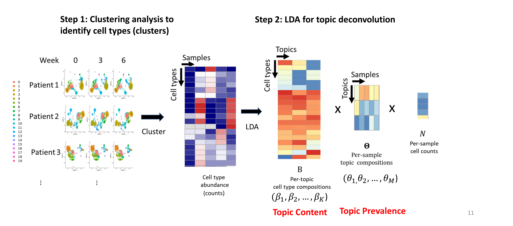

Latent Dirichlet Allocation (LDA) model is one of the most popular models in nature language processing. 
The intuition of the model is to discover co-occuring patterns that reflect the underlying topics which combined to form the documents.
LDA is also flexible enough to be embedded in more complex models for inference, e.x. structural topic model, dynamic topic model, hierarchical topic model, etc.

In single-cell analysis, LDA has been used to explore the heterogeneity in gene expression within samples. But it's rarely used to investigate the heterogeneity in single-cell data of a patient cohort.
However, we realize the great potential of LDA to explore the heterogeneity in single-cell data at patient or sample level, especially in tracking the dynamics of cell types across time.

This website shows examples of applications of Latent Dirichlet Allocation (LDA) model (We now call it **TopicFlow**) on different types of single-cell datasets.

- a scRNA-seq dataset of tumor tissue from liver cancer patients.  

- a longitudinal flow cytometry datasets of PBMCs from melanoma patients. 

If you find the approach useful, please cite: 

X. Peng, J. Lee, M. Adamow, C. Maher, M. A. Postow, M. Callahan, K. S.
Panageas, R. Shen (2023+). “Uncovering the hidden structure of dynamic T cell
composition in peripheral blood during cancer immunotherapy: a topic modeling
approach”. (Under Review) [[bioRxiv]](https://doi.org/10.1101/2023.04.24.538095)

