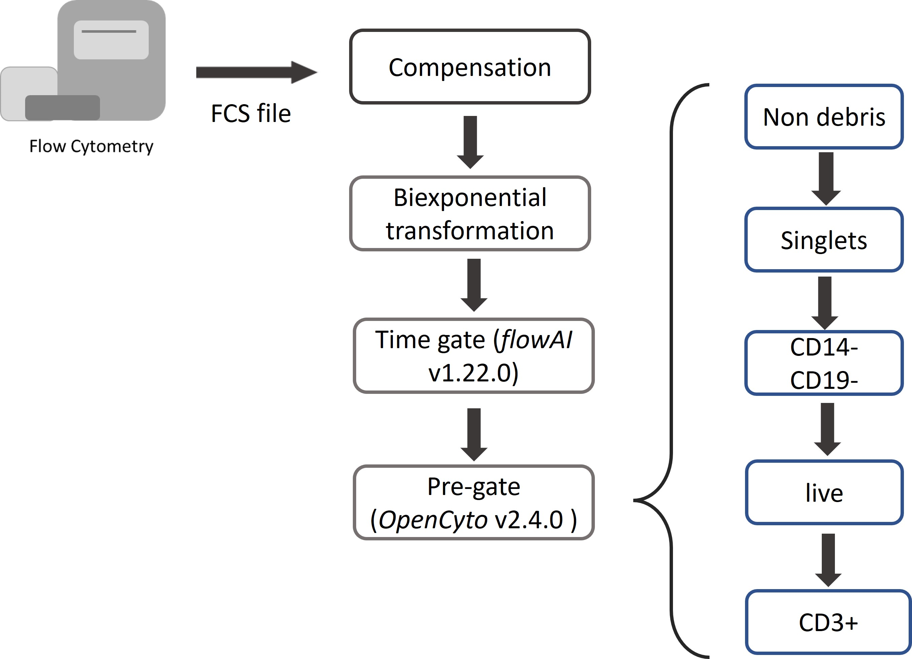

```{r setup, include=FALSE}
library(knitr)
knitr::opts_chunk$set(echo = TRUE)
knitr::opts_knit$set(root.dir= normalizePath('..'))
knitr::opts_chunk$set(error = FALSE)
knitr::opts_chunk$set(warning = FALSE, message = FALSE) 
```

Here we present our whole workflow for analyzing a longitudinal flow cytometry data from a large cohort study (Starting from FCS file to figures in the manuscript).
The whole workflow can be mainly devided into two parts:

- Single cell analysis on flow cytometry data (starting with raw FCS file)

- Evaluating pharmacodynamic changes of T cell composition with TopicFlow

We show our method TopicFlow allows us to mine tens of millions of single cells from a large collection of patient samples to discover the underlying functional themes that characterize the immune composition and the pharmacodynamics changes in cancer patients. 

More details about the study can be found in the manuscript. 
If you find the tool is useful, please cite our paper.

X. Peng, J. Lee, M. Adamow, C. Maher, M. A. Postow, M. Callahan, K. S.
Panageas, R. Shen (2023+). “Uncovering the hidden structure of dynamic T cell
composition in peripheral blood during cancer immunotherapy: a topic modeling
approach”. (Under Review)


# Single-cell flow cytometry analysis


## Pre-gating Analysis: from FCS file to single-cell dataset

Each Flow Cytometry Standard (FCS) file acquired from the flow cytometry experiments was independently preprocessed using our in-house automated gating pipeline (built with R 4.1.3). 
The main preprocessing steps include (See figure below): 

- compensation with matrices exported from FlowJo v10.8.0 software (BD Life Sciences), 

- biexponential transformation on all marker channels with parameters extra negative decades = 0.5, width basis = -30, positive decades = 4.5, 

- quality control via the R package flowAI (v1.22.0), 

- pre-gating up to CD3+ T cells via the R package openCyto (v2.4.0). 
The pre-gating strategy, as the input to openCyto R pakcage, can be find in [here].





## Quality control

When integrating multiple samples, it is important to check if there is a batch effect. 
To evaluate the possible batch effect, ridge plot can help to check the consistency of transformed intensity values across multiple patient samples, as the example shown below.
These Ridge plot can be easily made with the help of [Seurat](https://satijalab.org/seurat/index.html) R package.
From the figure shown below, we can find the transformed intensity values of all markers are roughly in the same scale.


We also recommend to downsample cells from each sample and use UMAP to check if there is a significant batch effect.
You may visually assess the UMAP plots and check if there is a significant batch effect among patient samples.

## Single-cell clustering analysis

For better visualization and analysis, we choose to use [Seurat Object](https://mojaveazure.github.io/seurat-object/index.html), a data structure provided by [Seurat](https://satijalab.org/seurat/index.html) R package, to store single cell data.
We provide the seurat objects (in rds files) of three patients as examples. 
They can be downloaded from [here](https://data.mendeley.com/datasets/d7nkgfhc8z).
For each flow sample (FCS file), there are about 100k cell on average.
For our panel, 29 markers (include live/dead, CD14-CD19 with shared fluorescence) are measured for each single cell.

For pooled clustering analysis, we pool all T cells from all patient samples together.
We then use Louvain algorithm, a graph-based algorithm for clustering cells.
Louvain is the core algorithm of [PhenoGraph](https://github.com/jacoblevine/PhenoGraph), the famous python library for clustering flow cytometry data.
The data file `seurat_object_17162_rerun_all_dim26.rds` that aggregate cells from all 138 samples is too big to be read by a personal laptop. 
We recommend to do the following analysis on a server with adequate memory space available.

The code below was run on a server. We requested 250GB memory space for analyzing 17M+ T cell. It runs about 5 days.

```{r,eval=FALSE}
library(Seurat)
library(future)
## parallel computing 
plan("multiprocess", workers = 8)
plan()
## increase the maximal size of a data object in R
options(future.globals.maxSize = 100000 * 1024^2)


### data_real_marks (n_cells x n_markers) 
### is a matrix of marker intensity values of all cells
#pool_X50 <- CreateSeuratObject(counts = t(data_real_marks), project = "17-162")
#pool_X50
#pool_X50[['time']]<-factor(time)
#pool_X50[['patient']]<-factor(patient)
#pool_X50[['sample']]<-factor(sample)
### read the pre-saved data
pool_X50 <- readRDS(file = "seurat_object_17162_rerun_all_dim26.rds")

## All 27 markers are variable markers across cells
## This step seems unnecessary but it cannot be skipped
pool_X50 <- FindVariableFeatures(object = pool_X50)

### scale each markers
all.genes <- rownames(pool_X50)
pool_X50 <- ScaleData(pool_X50, features = all.genes)

### PCA
pool_X50 <- RunPCA(pool_X50, features = all.genes,approx=FALSE,npcs = 26)

### UMAP based on 26 PCs. 
### Use min.dist = 0.1 for better separation
### Recommend the default 0.3 for visualizing each patient samples
pool_X50 <- RunUMAP(pool_X50, dims = 1:26,min.dist = 0.1)

### Construct KNN graph with a fast nearest neighbor search using RANN
pool_X50 <- FindNeighbors(pool_X50, dims = 1:26, nn.eps = 0.5,k.param = 5)

### Clustering cell with Louvain method based on KNN under different resolutions
### This step would be run in parallel
res<-c(0.5, 0.8, 1, 1.2, 1.5, 2, 2.5, 3)
pool_X50 <- FindClusters(pool_X50, resolution = res)

saveRDS(pool_X50, file = "seurat_object_17162_rerun_all_dim26.rds")
```


### Alternative approach for cell clustering

The pooled clustering strategy may not be applicable for a larger cohort study.
We are working on a pipeline using [FlowSOM](https://doi.org/10.1038/s41596-021-00550-0) for cell clustering. 
In FlowSOM, cells in each patient samples will be independently over-clustered using a self-organizing map (SOM, also a graph-based clustering method), then followed by a consensus clustering (using R package [ConsensusClusterPlus](https://bioconductor.org/packages/release/bioc/html/ConsensusClusterPlus.html)) to generate meta-clusters (clusters of clusters within each sample).
You may check the [protocol](https://doi.org/10.1038/s41596-021-00550-0) of FlowSOM for further details.
With the limited experience, the consensus clustering is expected to be the most time and memory consuming step in the analysis pipeline.

Codes below show an example how to convert the data to FlowSOM object.
```{r,eval=FALSE}
### select data for a single patient
pt_seurat<-subset(pool_X50,subset = patient == "17-162-03")
### convert to FlowSOM object
data_FlowSOM<-flowCore::flowFrame(t(as.matrix(pt_seurat[['RNA']]@data)))
tmp <- FlowSOM::ReadInput(data_FlowSOM, transform = FALSE, scale = FALSE)
```


For either clustering approach, you have to tun parameters to determine number of clusters.
For melanoma datasets, we chose the clustering solution under resolution 1.5 with the highest average Silhouette scores.
But once you have selected your clustering results, you can output cell count matrix (`clusterbysample`) per cluster per sample and visualize the clustering results with UMAP.

```{r,eval=FALSE}
## choose resolution = 1.5
Idents(pool_X50)<-"RNA_snn_res.1.5"
## output cell count per cluster per sample
clusterbysample<-table(pool_X50$sample,Idents(pool_all_X50))
## plot UMAP for the whole cohort
DimPlot(subset(pool_X50, idents = 1:20),reduction = "umap", label = TRUE)
```

Figure below shows the UMAP plot for a single patient. We annotate key clusters based on their marker expression.


The cell count matrix `clusterbysample` contains cell type abundance for each flow sample.
We further add sample information for each sample, including sample collection time and patient info, and clinical annotation for each patient, including response, toxicity,
and survival data.

As a tutorial for TopicFlow, the following analysis will use the supplementary data of the manuscript as the input.
The supplementary data can be downloaded from [here](https://github.com/xiyupeng/topic_modeling/blob/main/data/Supplementary%20Data%20File%20S1.csv).

# Explore sample-level heterogeneity with TopicFlow

## Getting ready

Firstly, we have to install core R packages required for LDA analysis.
We use the R package *topicmodels* for model inference, R package *slam* for preparing the input data, R package *tidytext* for extracting the output data. 

```{r}
library(topicmodels)
library(slam)
library(tidytext)
```

In this workflow, we use some R packages for data visualization and analysis. But these R packages are not necessary, you can use other similar R packages instead.

```{r}
library(tidyverse)
library(ComplexHeatmap)
library(ggpubr)
library(patchwork)
```

We read the supplementary data file of the manuscript.
The file contains the cell type count for individual samples (as the result of the clustering analysis), as well as patient clinical information.

```{r}
X50_result<-read.csv(file = "https://raw.githubusercontent.com/xiyupeng/topic_modeling/main/data/Supplementary%20Data%20File%20S1.csv")
X50_result<-X50_result[1:138,]  ## remove empty rows at the bottom
## toxicity 
X50_result$tox<-as.factor(X50_result$irAE...grade.2)
## response 
X50_result$res<-as.factor(X50_result$Best.Overall.Response)
levels(X50_result$res)<-c("CR/PR","PD/SD","CR/PR","PD/SD")
## time point
X50_result$Timepoint <-as.factor(X50_result$Timepoint)
X50_result$week<-X50_result$Timepoint 
levels(X50_result$week)<-c("0","3","6")
```

The final input data matrix for LDA has 138 samples with 20 features (clusters),
while each entry is number of cells per cluster per sample.

```{r}
## Only focus on first 20 clusters
X50_result %>% select(starts_with("cluster"))->data_matrix
data_matrix<-data_matrix[,1:20]
head(data_matrix[,1:8])
```

## Model inference

We use *topicmodels* R package for model inference. We use Gibbs sampling algorithm and choose number of topics K = 3:

- **Gibbs sampling**. The topicmodels R package provides two algorithms, variation EM and Gibbs sampling, for model inference. The two different algorithms may contribute to different results (See the [documentation](https://cran.microsoft.com/snapshot/2016-09-30/web/packages/topicmodels/vignettes/topicmodels.pdf) of the *topicmodels* R package).
But in the example given in the R package, the Gibbs sampling algorithm seems to return better models than Variation EM. 
Thus we prefer Gibbs sampling in the analysis. We used the following setting for Gibbs sampling: iter = 1000, burnin = 1000, thin = 100 (1000 Gibbs sampling draws are made with the first 1000 iterations discarded and then every 100th iteration kept).

- **K = 3**. Number of topics K also needs to be selected before running the model inference. There is no ``right’’ answer to the number of topics that are the most appropriate for data. You may use R package *ldatuning* or cross-validation to select number of topics K. 
In this case,
we failed to select the number of topics with a 10-fold cross-validation, likely a reflection of the size of the dataset (only 138 samples). Thus, we guided the choice of the number of topics based on what is most useful for scientific interpretation. Moreover, during the cross-validation, we observed the 
biggest drop in perplexity40 (a measure of how successfully a trained topic model predicts new data) is 
between K = 2 and K = 3. Thus we set K = 3 in this study.

The Gibbs sampling will take several minutes. We can save the result here for further analysis. The pre-run LDA results can be downloaded from [here](https://github.com/xiyupeng/topic_modeling/blob/main/data/lda_example_K3.Rdata).

Note: Gibbs sampling is a stochastic algorithm, but the result for this dataset is relative stable. If you choose to run LDA yourself with a different random seed or change the order of the input data, you may have to switch the order of the three topics to match the results.
But generally you should be able to identify the three topics which we will describe below: activation topic, 
exhaustion topic, and naive topic.


```{r,eval=FALSE}
require(slam)
require(topicmodels)

count_matrix_triplet <- as.simple_triplet_matrix(data_matrix)

lda<-LDA(count_matrix_triplet, control = list(seed = 2021, burnin = 1000,thin = 100, iter = 1000), k = 3, method = "Gibbs")

save(lda, file = "~/flow_cytometry/lda/lda_example_K3.Rdata")
```

Below we reload the data and check the output of the LDA model.

```{r}
## load the data
load(file = "~/flow_cytometry/lda/lda_example_K3.Rdata")
ntopics = 3

## extract output of the LDA model
para<-posterior(lda)
colnames(para$topics)<-paste0("topic",colnames(para$topics))
rownames(para$terms)<-paste0("topic",rownames(para$terms))

#### update to the meta data
X50_result$topics<-topics(lda)
X50_result<-as.data.frame(cbind(X50_result,para$topics))
```

The main output of the LDA model contains two matrix: 

1. **Topic content matrix** (cell type-by-topic matrix) represents topics as different discrete distributions over cell types (clusters)


```{r}
## show first five columns
head(round(para$terms[,1:5],3))
```


2. **Topic prevalence matrix** (topic-by-sample matrix) displays topic proportions estimated per sample 


```{r}
## show first five rows
head(round(para$topics,3))
```

The topic prevalence matrix will be merged with the original data frame for further analysis. But before we investigating the distribution of topics over patient samples, we want to exam the topic content matrix and interpret each topic by selecting representative cell types.

## Topic content

The intepretability of topic models is a key advantage. In text analysis, representative terms, in this case, representative clusters, are used to define topics. 
Sometimes people directly use the topic weights in topic content matrix to select representative terms.

In this case, you can simply find clusters with top weight for each topic with `terms()`,

```{r}
terms(lda,5)
```

or visualize them with barplots.

```{r,fig.width=4}
### beta
ap_topics <- tidy(lda, matrix = "beta")
ap_topics$topic<-as.factor(paste0("topic",ap_topics$topic))

### make barplots
ap_topics$term<-gsub("cluster","",ap_topics$term)
term_reorder<-as.character(c(0,2,6,11,9,8,7,1,4,10,12,14,15,3,5,13,16,17,18,19))
ggbarplot(ap_topics, x = "term", y = "beta",color = "topic",fill = "topic",palette = c("#D55E00", "#009E73", "#0072B2"),facet.by = "topic",nrow = 3)+xlab("T cell cluster")+scale_x_discrete(limits = term_reorder)+ylab("topic weight")
```

One main drawback of using topic weight to select representatives is that high abundant clusters with little variation are likely to be selected as representatives due to their high topic weights.
In our analysis, the top representative clusters from each topic are selected after ranking by lift, which is the log ratio of estimated topic weights over its empirical frequency. 
The lift metric gives higher weights to clusters that appear less frequently in other topics. 
This metric was proposed by Matt Taddy in the paper *On Estimation and Selection for Topic Models*,
and is also used in the R package *stm* for [structure topic model](https://www.structuraltopicmodel.com/).

Below we show top 10 clusters with top lift for each topic.
In practice, we find the metric lift provides the most interpretable results,
helping to select representative clusters for each topic.
Thus we can name each topic based upon the most representative cell clusters 
ranked by lift:

- Topic 1 (red) mainly contains  two CD8 Temra clusters 
(clusters 3 and 5), one CD4 cytotoxic Tem cluster (cluster 14, GzmB+), and one CD4-CD8- cluster (cluster 13). Thus we named it the **Exhaustion topic**.
- Topic 2 (green) we labeled the **Naive topic**, with CD4+ and CD8+ naive T cell clusters identified as the most representative clusters 
- Topic 3 (blue) is an **Activation topic** The five 
representative cell clusters we identified include two CD4 T cell clusters (clusters 8 and 4), one CD8 T cell cluster (cluster 12), one Treg cluster (cluster 9), and one CD4-CD8- T cell cluster (cluster 16). 
Most of clusters of topic 3 are KI67+ and they are expanding upon ICI treatment!
 

```{r}
### calculate the lift
wordcounts <- colSums(data_matrix)
logbeta <- lda@beta
emp.prob <- log(wordcounts) - log(sum(wordcounts))
lift <- logbeta - rep(emp.prob, each = nrow(logbeta))
colnames(lift)<-lda@terms
lift<-as.data.frame(lift)
lift$topics<-paste0("topic",1:3)

#### name three topics based on the content
new_label<-c("Exhaustion Topic","Naive Topic","Activation Topic")
names(new_label)<-c("topic1","topic2","topic3")

### show top 10 representative clusters for each topic
lift_top_terms <- lift %>% gather(.,key = cluster,value = lift,-topics) %>%
  group_by(topics) %>%
  slice_max(lift, n = 10) %>% 
  ungroup() %>%
  arrange(topics, -lift)

lift_top_terms %>%
  mutate(cluster = reorder_within(cluster, lift, topics)) %>%
  ggplot(aes(lift, cluster, fill = factor(topics))) +
  geom_col(show.legend = FALSE,orientation = "y") +
  facet_wrap(~ topics, scales = "free",labeller = labeller(topics = new_label)) + 
  scale_y_reordered()+theme_bw()+scale_fill_manual(values=c("#D55E00", "#009E73", "#0072B2"))+
  xlab("lift (log-ratio of topic weight over T cell cluster frequency)")+ylab("T cell cluster")
```


## Topic Prevalence

A heatmap can help to visualize the distribution of topics across patients.
In the heatmap, the activation topic mainly captures the expansion of 
Tcm/em upon treatment. For most patients, the proportion of the activation topic is near zero (dark blue) in pre-treatment samples (week 0). This topic emerges on-treatment as seen by the increase of topic proportions in weeks 3 and 6 samples. 
At baseline (week 0), most of the patient samples are characterized by a high presence of the naïve topic, which subsequently decreases after ICI treatment as cells transition into more “activated” states. In contrast, a small subgroup of patient samples (group1) has a 
low proportion of the naïve topic, but a high fraction of the exhaustion topic presented at week 0. 
There is no visible reduction in the exhausted T cell population after ICI treatment. 

```{r}
## set color for the heatmap
ann_colors = list(
  BOR = c(CR = "white",PR = "white", SD = "firebrick",PD = "firebrick"),
  Toxicity = c(N = "white",Y = "darkblue"),
  topics = c(`1` = "#0072B2", `2` = "#009E73",`3` = "#D55E00",Activation = "#0072B2", Naive = "#009E73", Exhaustion = "#D55E00" ),
  Immunotype = c("LAG-" =  "#555599", "LAG+" =  "#66BBBB", PRO = "#DD4444"),
  Group = c(group1 = "#7570B3", group2 = "#E7298A", group3 = "#66A61E",group4 = "#D95F02")
)

## Annotation columns
annotation_column = data.frame(
  topics = factor(rep(c("Exhaustion","Naive","Activation"),each = 3))
)

## Annotation rows
pt_meta<-X50_result %>% select(PatientID,Immunotype,tox,Best.Overall.Response) %>% arrange(PatientID) %>% distinct(PatientID,.keep_all = TRUE)
colnames(pt_meta)<-c("pt","Immunotype","Toxicity","BOR")
rownames(pt_meta)<-pt_meta$pt
```

```{r,fig.width=12,fig.height=12}
## reshape the gamma matrix (topic fraction) for heatmap representation
rownames(para$topics)<-X50_result$sample
gamma_data<-as.data.frame(para$topics)
gamma_data$pt<-as.factor(X50_result$PatientID)
gamma_data$time<-as.factor(X50_result$Timepoint)
gamma_wide_wna<-gamma_data %>% arrange(pt, time)%>%reshape(.,timevar = "time",idvar = "pt",direction = "wide") ## keep missing value as NA in the matrix
rownames(gamma_wide_wna)<-gamma_wide_wna$pt
head(gamma_wide_wna)
```

When making the heatmap, patient 17-162-08 was excluded since this patient only has week 0 sample and makes trouble for the heatmap.
In the heatmap shown below, you can find the other two patients missing week 0 sample.

```{r,fig.width=12,fig.height=12}
## exclude pt 17-162-08 in the meta data
pt_meta_wo6<-pt_meta[-6,]  

## we want to use the order of patients (rows) outside the heatmap.
## Thus patients are pre-grouped before heatmap
ourdist<-dist(gamma_wide_wna[-6,-1])  ## again, excluding pt 17-162-08 
re<-hclust(ourdist)
group<-as.data.frame(cutree(hclust(ourdist),5))  
colnames(group)<-"Group"
pt_meta_wo6<-cbind(pt_meta_wo6,group)
pt_meta_wo6$Group<-factor(pt_meta_wo6$Group)
levels(pt_meta_wo6$Group)<-c("group4","group3","group1","group2","group1")

## reorder columns by each topic in the heatmap (still excluding pt 17-162-08)
gamma_wide_wna_reorder<-gamma_wide_wna[-6,order(colnames(gamma_wide_wna))]
col_labels<-rep(c("week0","week3","week6"),3)

## heatmap
ComplexHeatmap::pheatmap(gamma_wide_wna_reorder[,-1],cluster_cols = FALSE,drop_levels = TRUE,annotation_colors = ann_colors,annotation_row = pt_meta_wo6[,2:5],col = colorRampPalette(c("navy", "white", "firebrick3"))(50),fontsize_row= 5,labels_col = col_labels,annotation_col = annotation_column, column_split = annotation_column$topics,cutree_rows = 4)
```

LDA can not only identify the topics, but also quantify topic fraction within each sample.
It can provide novel insights on complex immune phenotypes among patients and identify complex and unique pharmacodynamic changes upon treatment.
We can also show topic fraction within each patient sample with stackplots, each at week 0, week 3, and week6.
For better separation, we use the same order of patients as in the heatmap.
The trends have been described in the heatmap.

```{r,fig.width=12,fig.height=8}
## add back data of 17-162-08, which has only week 0 data
## use the same patient order as in the heatmap
my_orders<- c(rownames(gamma_wide_wna_reorder)[re$order],"17-162-08")
my_labels<-gsub("17-162*","",my_orders)
my_labels<-gsub("-","",my_labels)

## stackplots for week 0
topic_fraction<-gamma_wide_wna %>% 
  select("topic1.A","topic2.A","topic3.A","pt") %>%  
  gather(key = "Topic",value = "fraction",-pt) %>% na.omit()
topic_fraction$Topic<-as.factor(topic_fraction$Topic)
levels(topic_fraction$Topic)<-c("Activation topic", "Naive topic", "Exhaustion topic")

p1<-ggbarplot(topic_fraction,"pt","fraction",fill = "Topic",palette = c("#D55E00", "#009E73","#0072B2"),color = "Topic")+scale_x_discrete(limits = my_orders[my_orders %in% topic_fraction$pt],labels = my_labels[my_orders %in% topic_fraction$pt])+ylab("Topic fraction")+xlab("Patient")
p1<-ggpar(p1,legend = "none",title = "week 0",font.xtickslab  = c(5,"bold"),xtickslab.rt = 45)

## stackplots for week 3
topic_fraction<-gamma_wide_wna %>% 
  select("topic1.B","topic2.B","topic3.B","pt") %>% 
  gather(key = "Topic",value = "fraction",-pt) %>% na.omit()
topic_fraction$Topic<-as.factor(topic_fraction$Topic)
levels(topic_fraction$Topic)<-c("Activation topic", "Naive topic", "Exhaustion topic")

p2<-ggbarplot(topic_fraction,"pt","fraction",fill = "Topic",palette = c("#D55E00", "#009E73", "#0072B2"),color = "Topic")+scale_x_discrete(limits = my_orders[my_orders %in% topic_fraction$pt],labels = my_labels[my_orders %in% topic_fraction$pt])+ylab("Topic fraction")+xlab("Patient")
p2<-ggpar(p2,legend = "none",title = "week 3",font.xtickslab  = c(5,"bold"),xtickslab.rt = 45)

## strackplots for week 6
topic_fraction<-gamma_wide_wna %>% 
  select("topic1.C","topic2.C","topic3.C","pt") %>% 
  gather(key = "Topic",value = "fraction",-pt) %>% na.omit()
topic_fraction$Topic<-as.factor(topic_fraction$Topic)
levels(topic_fraction$Topic)<-c("Activation topic", "Naive topic", "Exhaustion topic")

p3<-ggbarplot(topic_fraction,"pt","fraction",fill = "Topic",palette = c("#D55E00", "#009E73", "#0072B2"),color = "Topic")+scale_x_discrete(limits = my_orders[my_orders %in% topic_fraction$pt], labels = my_labels[my_orders %in% topic_fraction$pt])+ylab("Topic fraction")+xlab("Patient")
p3<-ggpar(p3,legend = "none",title = "week 6",font.xtickslab  = c(5,"bold"),xtickslab.rt = 45)

wrap_plots(p1,p2,p3)
```


## Pharmacodynamics of patient subgroups


We may simply use boxplot to visualize the pharmacodynamics of topics within each patient subgroups.
In the figure shown below, each subgroup exhibits distinct dynamic patterns within the three interpretable topics:

- Patients in groups 1 and 2 both have inferior increases in activation topic. Group 1 has the highest proportion of the exhaustion topic and group 2 has the highest naïve topic across time. 
- Patients in group 3 have the highest increase in the activation topic compared to other groups and are accompanied by the highest decrease in the naïve topic fraction. 
- Patients in group 4 has a high proportion of the naïve topic at week 0 and a moderate increase in the activation topic. Patients in group 4 are more 
likely to experience severe ICI-related toxicity compared to other groups.

```{r,fig.width=12,fig.height=12}
## Parepare input data. add assigned group to each patient
integrate_data<-merge(gamma_data,pt_meta_wo6[,c(1,5)],by.x = "pt",by.y = "pt")  
integrate_data_reformat<-integrate_data %>% 
  gather(key = "Topic", value = "Proportion",topic1, topic2, topic3)
integrate_data_reformat$week<-as.factor(integrate_data$time)
levels(integrate_data_reformat$week)<-c(0,3,6)


### boxplots show pharmacodynamics of four groups
color <- c(group1 = "#7570B3", group2 = "#E7298A", group3 = "#66A61E",group4 = "#D95F02")
new_label<-c("Exhaustion Topic","Naive Topic","Activation Topic")
names(new_label)<-c("topic1","topic2","topic3")
p1<-integrate_data_reformat %>%
  filter(Group == "group1") %>%
  ggboxplot(.,x = "week", y = "Proportion",add = "point",fill = color["group1"])+geom_line(aes(group = pt),color = 'darkgray')+theme(legend.position = "none")+facet_wrap(vars(Topic),nrow = 1,labeller = labeller(Topic = new_label))+ggtitle("group1")
p2<-integrate_data_reformat %>%
  filter(Group == "group2") %>%
  ggboxplot(.,x = "week", y = "Proportion",add = "point",fill = color["group2"])+geom_line(aes(group = pt),color = 'darkgray')+theme(legend.position = "none")+facet_wrap(vars(Topic),nrow = 1,labeller = labeller(Topic = new_label))+ggtitle("group2")
p3<-integrate_data_reformat %>%
  filter(Group == "group3") %>%
  ggboxplot(.,x = "week", y = "Proportion",add = "point",fill = color["group3"])+geom_line(aes(group = pt),color = 'darkgray')+theme(legend.position = "none")+facet_wrap(vars(Topic),nrow = 1,labeller = labeller(Topic = new_label))+ggtitle("group3")
p4<-integrate_data_reformat %>%
  filter(Group == "group4") %>%
  ggboxplot(.,x = "week", y = "Proportion",add = "point",fill = color["group4"])+geom_line(aes(group = pt),color = 'darkgray')+theme(legend.position = "none")+facet_wrap(vars(Topic),nrow = 1,labeller = labeller(Topic = new_label))+ggtitle("group4")
wrap_plots(p1,p2,p3,p4,nrow = 4)
```


